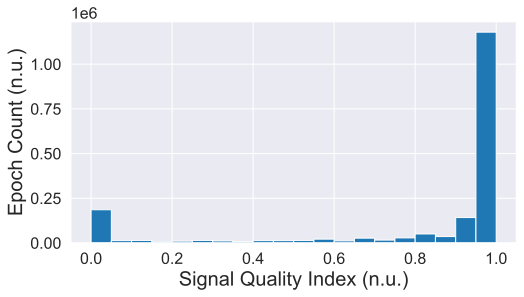

# CinC2023

Predicting Neurological Recovery from Coma After Cardiac Arrest: The George B. Moody PhysioNet Challenge 2023

<!-- toc -->

- [The Conference](#the-conference)
- [Description of the files/folders(modules)](#description-of-the-filesfoldersmodules)
- [Distributions of the EEG data against clinical information of the patients](#corr)
- [External Resources Used](#external-resources-used)
  - [SQI (Signal Quality Index) Calculation](#sqi)

<!-- tocstop -->

## The Conference

[Conference Website](https://cinc2023.org/)

Click to view the conference poster

  

Conference paper: [GitHub](https://github.com/wenh06/cinc2023_paper) | [IEEE Xplore](https://ieeexplore.ieee.org/document/10364014) | \[CinC Papers On-line\](https://cinc.org/archives/2023/pdf/CinC2023-060.pdf)

:point_right: [Back to TOC](#cinc2023)

## Description of the files/folders(modules)

### Files

Click to view the details

- [README.md](README.md): this file, serves as the documentation of the project.
- [cfg_models.py](cfg_models.py), [cfg.py](cfg.py): configuration files (the former for configuration of models, the latter for configuration of the whole project)
- [data_reader.py](data_reader.py): data reader, including data downloading, file listing, data loading, etc.
- [dataset.py](dataset.py): dataset class, which feeds data to the models.
- [Dockerfile](Dockerfile): docker file for building the docker image for submissions.
- [requirements.txt](requirements.txt), [requirements-docker.txt](requirements-docker.txt), [requirements-no-torch.txt](requirements-no-torch.txt): requirements files for different purposes.
- [trainer.py](trainer.py): trainer class, which trains the models.

### Folders(Modules)

Click to view the details

- [models](models): folder for model definitions, including [CRNN models](models/crnn.py), and [traditional ML models](models/ml.py). The latter serves as a minimal garantee model using patient metadata only, which is used when no (EEG) data is available. It is indeed a wrapper containing model construction, training, hyperparameter tuning via grid search, model saving/loading, and end-to-end inference (from raw input to the form of output that the challenge requires).
- [utils](utils): various utility functions, as well as some intermediate data files (e.g. train-val split files, etc.). SQI computation code, as mentioned in the unofficial phase (and also the [v1 version of the I-CARE database](https://physionet.org/content/i-care/1.0/)). This will be described in detail in the [External Resources Used](#external-resources-used) section.

:point_right: [Back to TOC](#cinc2023)

##  Distributions of the EEG data against clinical information of the patients

  
  &nbsp; &nbsp; &nbsp;
  
  &nbsp; &nbsp; &nbsp;
  

:point_right: [Back to TOC](#cinc2023)

## External Resources Used

###  SQI (Signal Quality Index) Calculation

[Source Code](utils/sqi.py) integrated from [bdsp-core/icare-dl](https://github.com/bdsp-core/icare-dl/blob/main/Artifact_pipeline.zip).

As stated in the `Artfiact Screening (Signal Quality)` subsection of the `Data Description` section of the
[I-CARE database version 1.0 hosted at PhysioNet](https://physionet.org/content/i-care/1.0/), the SQI is calculated as follows:
<blockquote>
...This artifact score is based on how many 10-second epochs within a 5-minute EEG window are contaminated by artifacts. Each 10-second epoch was scored for the presence of the following artifacts including: 1) flat signal, 2) extreme high or low values, 3) muscle artifact, 4) non-physiological spectra, and 5) implausibly fast rising or decreasing signal amplitude...
</blockquote>

Precomputed SQI (5min window (epoch), 1min step length) for all EEGs: [Google Drive](https://drive.google.com/u/0/uc?id=1yPeLkL7WmHzXfSi5XK7hzWTfcAvrL8_q) | [Alternative](https://deep-psp.tech/Data/CinC2023-SQI.zip)

Distribution of SQI for all 5min windows (epochs):

:point_right: [Back to TOC](#cinc2023)

[CinC2020](https://github.com/DeepPSP/cinc2020) | [CinC2021](https://github.com/DeepPSP/cinc2021) | [CinC2022](https://github.com/DeepPSP/cinc2022)
