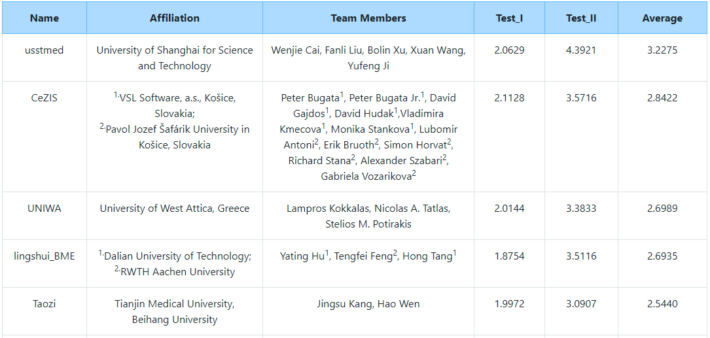
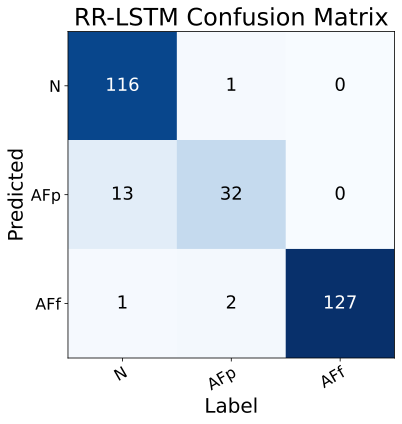
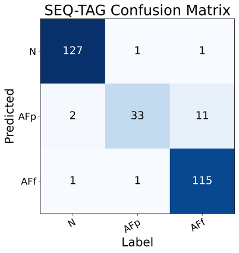
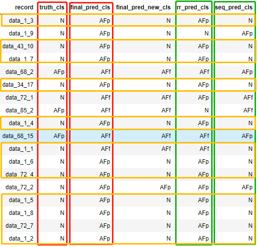
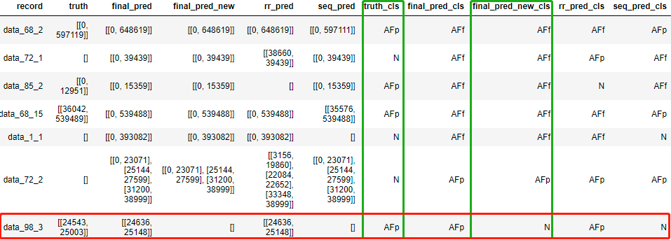

# [CPSC2021](http://2021.icbeb.org/CPSC2021)

Paroxysmal Atrial Fibrillation Events Detection from Dynamic ECG Recordings: The 4th China Physiological Signal Challenge 2021

## Offline generated training data

[CPSC2021-sliced](https://www.kaggle.com/wenh06/cpsc2021-sliced) on Kaggle.

## Results (Rankings)

### Results on the full hidden test set (only the top 5 of the official entries are included)

Check the [official website](http://2021.icbeb.org/CPSC2021) for the full list.

### Results on the validation set

Raw results are gathered into one zip file, the `val_res.zip` in the [`results`](results/) folder

|     Network(s)    | Merge Rule    | Score on Partial Hidden Test Set | Score on Validation Set|
|-------------------|---------------|----------------------------------|------------------------|
|   LSTM            |  NA           |   1.9392                         | 2.0621                 |
|   SeqTag          |  NA           |   1.9781                         | 2.1577                 |
|   U-Net           |  NA           |   1.3699                         | NA                     |
|  LSTM + U-Net     |  Union        |   1.7829                         | NA                     |
|  LSTM + SeqTag    | Intersection  |   1.9287                         | NA                     |
|  LSTM + SeqTag    |  Union        |   1.9766                         | 2.1682                 |
| **LSTM + SeqTag** | **New Union** |   **1.9972**                     | **2.2179**             |

### Confusion matrices of the LSTM model and the SeqTag model on the validation set

  
  &nbsp; &nbsp; &nbsp; &nbsp;&nbsp; &nbsp; &nbsp; &nbsp;
  

### More detailed analysis using `pandas` on the validation set

  
  

## References
to add ...

## [original repository](https://github.com/DeepPSP/cpsc2021)
