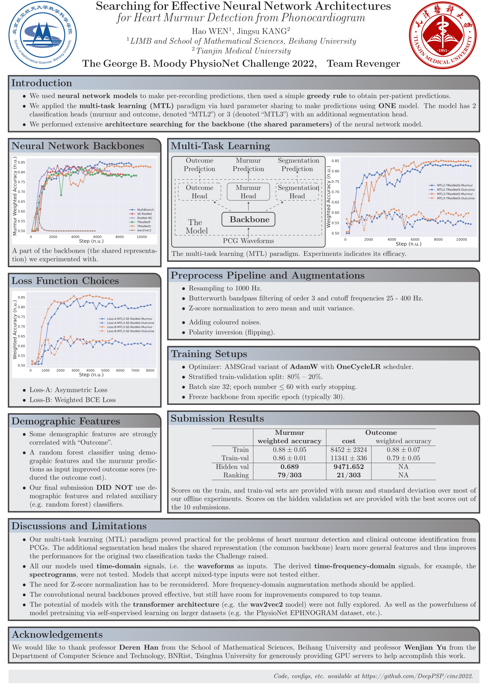

# CinC2022


Heart Murmur Detection from Phonocardiogram Recordings: The George B. Moody PhysioNet Challenge 2022

<!-- toc -->

- [Knowledge about Heart Murmur](#knowledge)
- [The Conference](#the-conference)
  - [Conference Paper](#conference-paper)
  - [Conference Poster](#conference-poster)
- [Final Scores](#final-scores)
- [Top Team Papers](#top-team-papers)
- [Official Phase Leaderboards](#official-phase-leaderboards)
- [Miscellaneous](#miscellaneous)

<!-- tocstop -->

## <a name="knowledge"></a> Knowledge about Heart Murmur

[utils/HeartMurmur.md](utils/HeartMurmur.md) contains knowledge about heart murmur collected from various sources.

## The Conference

[Conference Website](https://events.tuni.fi/cinc2022/)

[Conference Program](https://cinc.org/prelim_program_2022/)

### Conference Paper

<details>
<summary>Click to view!</summary>

~~Folder [tex](tex) contains latex source code for the CinC2022 conference paper, written using [Overleaf](https://www.overleaf.com/).~~

Moved to another repository as the size of the whole repository exceeds the limit of [Overleaf](https://www.overleaf.com/).

</details>

[Preprint](https://cinc.org/2022/Program/accepted/130_Preprint.pdf)

### Conference Poster

Poster created with `baposter` using the [Overleaf template](https://www.overleaf.com/latex/examples/poster-for-conference-niweek-2014-example/pzbtqgpvdbfh#.V7xgS02LRaQ)

<details>
<summary>Click to view!</summary>



</details>

## Final Scores

Final scores are released in [https://physionetchallenges.org/2022/results/](https://physionetchallenges.org/2022/results/) in 5 `.tsv` files.

These files were gathered in one [`.xlsx` file](results/final_scores.xlsx),
which was uploaded into [Google Sheets](https://docs.google.com/spreadsheets/d/17RPPzMTV9WW0QHToIvFEfhHw47LYx3LgQZxJSeDElzg/edit?usp=sharing).

<details>
<summary>Click to expand!</summary>

~~Final score files would keep on changing for some time as unofficial teams are having their rebuttals against the organizers.~~

Final score files were frozen from 2022/09/18 (Updated again....).

One can load the 5 tables all at once via

```python
pd.read_excel("./results/final_scores.xlsx", engine="openpyxl", sheet_name=None)
```

One can get a digest of the scores and rankings of all metrics (Weighted Accuracy, Cost, etc.) for the murmur task and the outcome task via

```python
from utils._final_results import get_team_digest

get_team_digest("Revenger", fmt="pd", latest=True)  # pandas DataFrame format
get_team_digest("Revenger", fmt="tex", latest=True)  # latex format (string)
```

</details>

## Top Team Papers

<details>
<summary>Click to view!</summary>

- [CUED_Acoustics](https://cinc.org/2022/Program/accepted/20_Preprint.pdf)
- [HearHeart](https://cinc.org/2022/Program/accepted/165_Preprint.pdf)
- [HearTech](https://cinc.org/2022/Program/accepted/439_Preprint.pdf)
- [prna](https://cinc.org/2022/Program/accepted/309_Preprint.pdf)
- [CeZIS](https://cinc.org/2022/Program/accepted/67_Preprint.pdf)
- [CAU_UMN](https://cinc.org/2022/Program/accepted/71_Preprint.pdf)
- [Melbourne Kangas](https://cinc.org/2022/Program/accepted/310_Preprint.pdf)

</details>

## Official Phase Leaderboards

[Murmur](https://docs.google.com/spreadsheets/u/0/d/e/2PACX-1vRNBATogMRsfio3938bU4r6fcAad85jNzTbSRtRhQ74xHw9shuYoP4uxkK6uKV1zw8CKjPC3AMm33qn/pubhtml/sheet?headers=false&gid=0)

[Outcome](https://docs.google.com/spreadsheets/u/0/d/e/2PACX-1vRNBATogMRsfio3938bU4r6fcAad85jNzTbSRtRhQ74xHw9shuYoP4uxkK6uKV1zw8CKjPC3AMm33qn/pubhtml/sheet?headers=false&gid=1883863848)

<details>
<summary>Click to expand!</summary>

The leaderboards can be loaded via

```python
# beautifulsoup4 and html5lib required
import pandas as pd

outcome_url = "https://docs.google.com/spreadsheets/u/0/d/e/2PACX-1vRNBATogMRsfio3938bU4r6fcAad85jNzTbSRtRhQ74xHw9shuYoP4uxkK6uKV1zw8CKjPC3AMm33qn/pubhtml/sheet?headers=false&gid=1883863848"
murmur_url = "https://docs.google.com/spreadsheets/u/0/d/e/2PACX-1vRNBATogMRsfio3938bU4r6fcAad85jNzTbSRtRhQ74xHw9shuYoP4uxkK6uKV1zw8CKjPC3AMm33qn/pubhtml/sheet?headers=false&gid=0"

df_outcome = pd.read_html(outcome_url, flavor="bs4", header=[1], index_col=[0])[0].reset_index(drop=True).dropna()
df_outcome.Rank = df_outcome.Rank.astype(int)
# df_outcome.set_index("Rank", inplace=True)  # Rank has duplicates
df_murmur = pd.read_html(murmur_url, flavor="bs4", header=[1], index_col=[0])[0].reset_index(drop=True).dropna()
df_murmur.Rank = df_murmur.Rank.astype(int)
# df_murmur.set_index("Rank", inplace=True)  # Rank has duplicates
```

pattern for the content of email announcing the submission scores:

```python
from string import punctuation

team_name_pattern = f"""[\\w\\s{punctuation}]+"""
email_pattern = (
    f"""We processed an entry from Team (?P<team_name>{team_name_pattern}) """
    """for the Official phase of the George B\\. Moody PhysioNet Challenge 2022\\. """
    """This entry was submitted on (?P<submission_time>[\\d]{1,2}/[\\d]{1,2}/2022 [\\d]{1,2}:[\\d]{1,2}:[\\d]{1,2} ET) """
    f"""with ID (?P<submission_id>{team_name_pattern}_[\\d]{{1,5}}_[\\d]{{1,3}})\\.[\\n]+"""
    """We successfully evaluated your entry, which received the score (?P<outcome_cost>[\\d\\.]+) and """
    """(?P<murmur_weighted_accuracy>[\\d\\.]+) using the Challenge evaluation metric on the validation set\\. """
    """This entry was your team's (?P<submission_number>[\\d]{1,2})/10 entry for the Official phase\\."""
)
# usage:
# list(re.finditer(email_pattern, email_content))[0].groupdict()
```

</details>

## Miscellaneous

<details>
<summary>Click to view!</summary>

### Test Files

The file [`test_docker.py`](test_docker.py) along with the [docker CI action](https://github.com/DeepPSP/cinc2022/blob/master/.github/workflows/docker-image.yml) can almost guarantee that the Challenge submissions won't raise errors, except for CUDA (GPU) errors. For possible CUDA errors, detect with [`test_local.py`](https://github.com/DeepPSP/cinc2022/blob/master/test_local.py).

### <a name="springer"></a> Python Re-Implementation of Springer's PCG Features Extractor

[`pcg_springer_features`](https://github.com/DeepPSP/pcg_springer_features) re-implements the feature extraction part of [David Springer's logistic regression-HSMM-based reart sound segmentation algorithm](https://physionet.org/content/hss/1.0/).

Inside [utils](utils) there's also a copy of `pcg_springer_features`.

</details>

## [original repository](https://github.com/DeepPSP/cinc2022)
