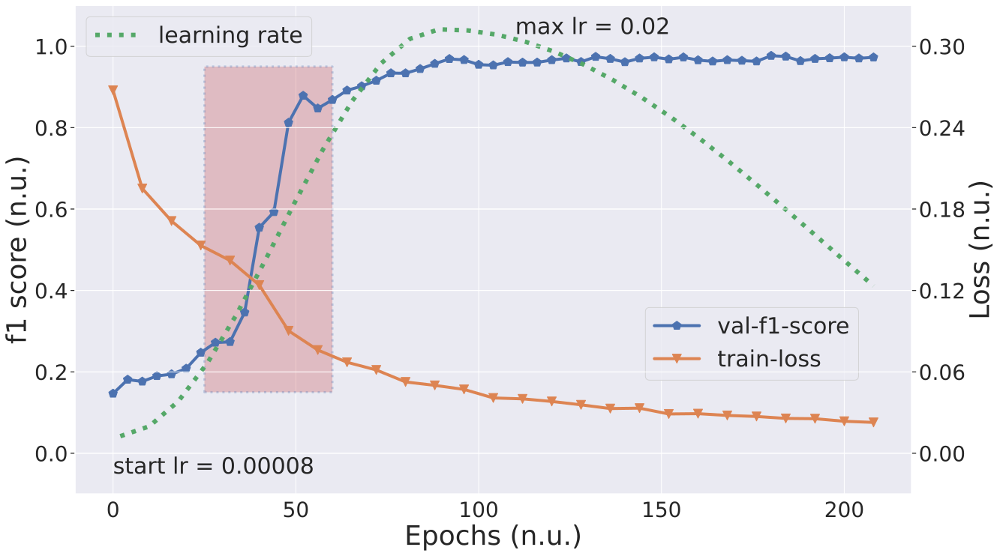
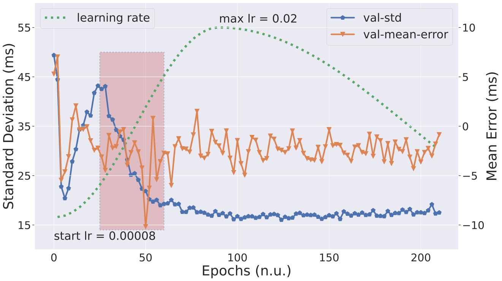
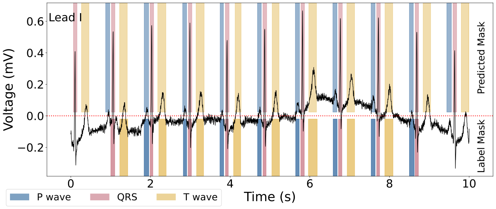

# ECG UNET

Re-production of the model proposed in Reference \[[1](#ref1)\] using LUDB

## Training

A typical experiment of training a U-Net model for wave delineation

Curves of train loss and validation f1 score | Curves of the mean error and standard deviation
:-------------------------------------------:|:-----------------------------------------------:
  |  

## Evaluation

An example of a trained wave delineation U-Net model evaluated on a 10s segment from the validation set

## References

1.  Moskalenko, Viktor, Nikolai Zolotykh, and Grigory Osipov. "Deep Learning for ECG Segmentation." International Conference on Neuroinformatics. Springer, Cham, 2019.
