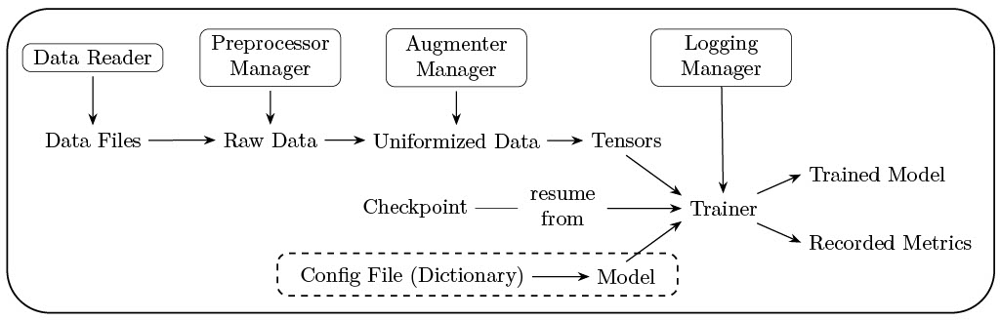

.. torch_ecg documentation master file, created by
   sphinx-quickstart on Mon Jul  5 15:53:33 2021.
   You can adapt this file completely to your liking, but it should at least
   contain the root `toctree` directive.

Welcome to torch-ecg's documentation!
=====================================

ECG Deep Learning Framework Implemented using PyTorch.

The system design is depicted as follows

.. toctree::
   :caption: Getting started
   :maxdepth: 1

   install
   tutorial

.. toctree::
   :caption: API Reference
   :maxdepth: 1

   databases
   models
   augmenters
   preprocessors
   components
   utils

.. toctree::
   :caption: Examples
   :maxdepth: 1

   examples

Indices and tables
==================

* :ref:`genindex`
* :ref:`modindex`
* :ref:`search`
