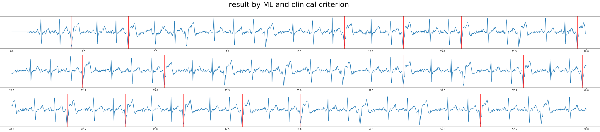

# [CPSC2020](http://www.icbeb.org/CSPC2020)

Searching for Premature Ventricular Contraction and Supraventricular Premature Beat from Long-term ECGs: The 3rd China Physiological Signal Challenge 2020

## Update on 2020/12/31
--------------------
Tests are done on a 60s segment (median-filtered and bandpassed, `sample1_fs250.mat` in [this folder](sample_data/)) of a subject with frequent PVC.
* r peak detections are done using [this function](https://github.com/wenh06/cpsc2020/blob/master/signal_processing/ecg_rpeaks_dl.py#L33).
* PVC beats are labeled using red vertical lines.
* missed PVC beats are labeled using yellow boxes.

* the first image is the result by a <strong>modified version</strong> of machine learning algorithms from [this repo](https://github.com/mondejar/ecg-classification) using rr features and wavelet features, with post-processing using clinical rules.
* the second image is the result of the sequence labeling deep learning model with probability threshold 0.3, and filtered by a deep learning classifier. The missed PVC beats are caused by this classifier.
* the last image is the result of the sequence labeling deep learning model with probability threshold 0.5, and filtered by a deep learning classifier.

### Observations
* a good rpeak (qrs complex) detector is crucial.
* the sequence labeling deep learning model (trained only for a dozen epochs because of the approaching deadline) tends to make false positive predictions but seldom has false negatives; while the deep learning classifier (trained only for several hundred epochs) has few false positives but has slightly higher probability to have false negatives.
* given a good rpeak detector, machine learning models might well be competitive against deep learning models.
* changing the threshold of the sequence labeling deep learning model from 0.5 to 0.3 can largely reduce the PVCerr score (punishment); further removing the post-filtering of the deep learning classifier might further reduce the scores, raising more false positives while reducing false negatives, considering that false negative has punishment 5 times as the punishment of false positives.

## Evaluation result
-----------------
[Evaluation result](http://www.icbeb.org/CSPC2020) on the final full hidden test set

not fully listed

## References:
-----------
[1] [ecg-classification](https://github.com/mondejar/ecg-classification)

[2] [BioSPPy](https://github.com/PIA-Group/BioSPPy)

[3] Cai, Wenjie, and Danqin Hu. "QRS complex detection using novel deep learning neural networks." IEEE Access (2020).

[4] [torch_ecg](https://github.com/wenh06/torch_ecg)

## TODO:
-----
[1] more robust qrs detector (finished)

[2] feature engineering (deprecated)

[3] deep learning model structure design (ongoing)

[4] use SNR to deal with (eliminate?) too noisy segments?

[5] etc....

## [original repository](https://github.com/wenh06/cpsc2020)
-------

