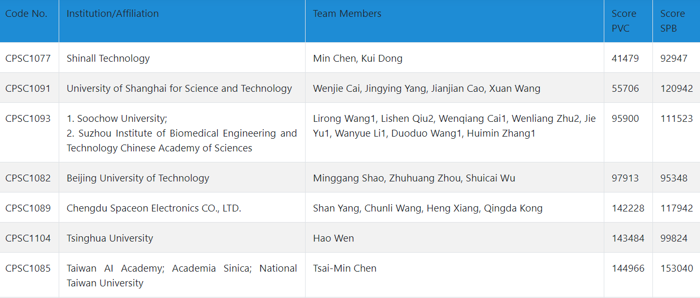

# [CPSC2020](http://www.icbeb.org/CSPC2020)

Searching for Premature Ventricular Contraction and Supraventricular Premature Beat from Long-term ECGs: The 3rd China Physiological Signal Challenge 2020

[Evaluation result](http://www.icbeb.org/CSPC2020) on the final full hidden test set
-----------

not fully listed

phase one result using traditional machine learning models can be found [here](https://github.com/wenh06/cpsc2020/tree/master/phase_one_legacy)

References:
-----------
[1] [ecg-classification](https://github.com/mondejar/ecg-classification)

[2] [BioSPPy](https://github.com/PIA-Group/BioSPPy)

[3] Cai, Wenjie, and Danqin Hu. "QRS complex detection using novel deep learning neural networks." IEEE Access (2020).

[4] [torch_ecg](https://github.com/wenh06/torch_ecg)

TODO:
-----
[1] more robust qrs detector (finished)

[2] feature engineering (deprecated)

[3] deep learning model structure design (ongoing)

[4] use SNR to deal with (eliminate?) too noisy segments?

[5] etc....

[original repository](https://github.com/wenh06/cpsc2020)
-------

