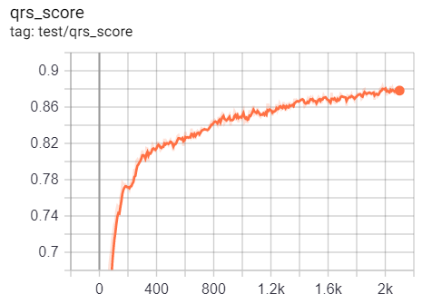
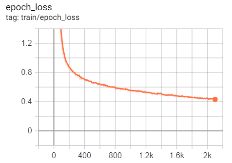

# [CPSC2019](http://2019.icbeb.org/Challenge.html)

re-production of SOTA model of [CPSC2019](http://2019.icbeb.org/Challenge.html)
-----------
original code can be downloaded [here](https://opensz.oss-cn-beijing.aliyuncs.com/ICBEB2020/file/CPSC2019-opensource.zip)

evaluation result of the sequence labeling CNN model
-----------

images can be re-produced via ``downloading`` the data csv file from the ``tfevents`` file in the ``results`` folder, and use ``MovingAverage`` in [this file](../database_reader/database_reader/utils/utils_signal/utils_signal.py) to simulate the ``smooth`` functionality in the Tensorboard Scalar panel.

the sequence labeling CRNN model not tested yet.
