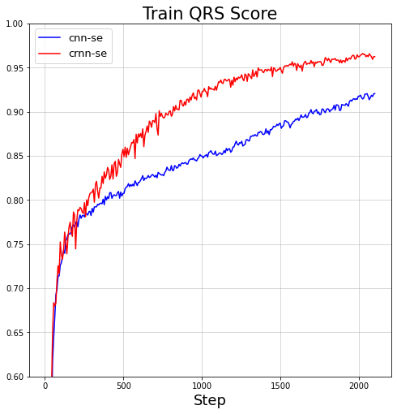
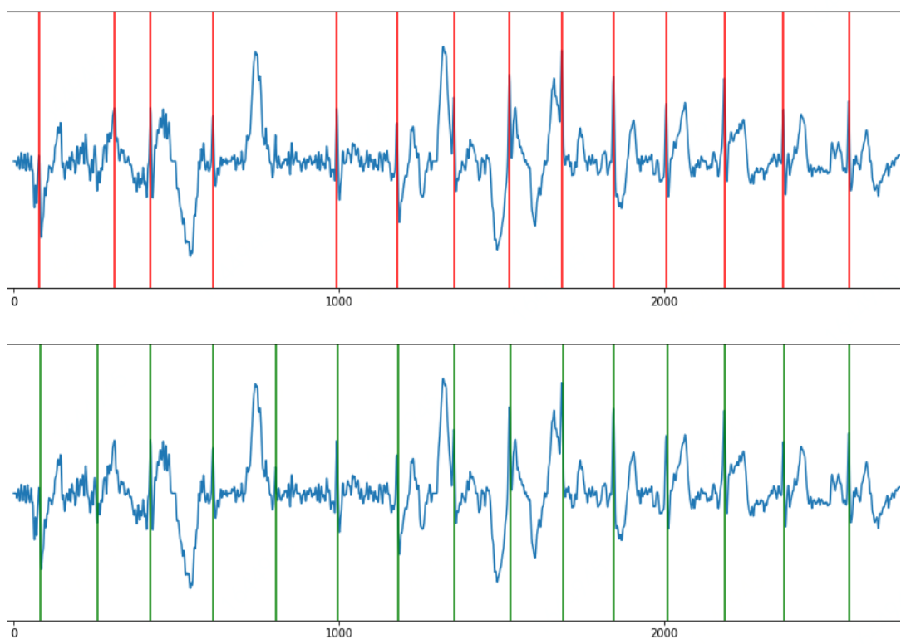

# [CPSC2019](http://2019.icbeb.org/Challenge.html)

re-production of SOTA model of [CPSC2019](http://2019.icbeb.org/Challenge.html)

original code can be downloaded [here](https://opensz.oss-cn-beijing.aliyuncs.com/ICBEB2020/file/CPSC2019-opensource.zip)

## evaluation result of the sequence labeling CNN model
-----------

test qrs score             |  train epoch loss
:-------------------------:|:-------------------------:
  |  

images can be re-produced via ``downloading`` the data csv file from the ``tfevents`` file in the ``results`` folder, and use ``MovingAverage`` in [this file](https://github.com/wenh06/utils/blob/master/utils_signal/utils_signal.py#L1458) to simulate the ``smooth`` functionality in the Tensorboard Scalar panel.

## more evaluation result (updated on 2021-02-08)

NOTE: the ticks of the following plots are unable to be seen in the dark theme!

test qrs score             |  train qrs score          | train epoch loss
:-------------------------:|:-------------------------:|:-------------------------:
  |   | 

more detailed results can be found [here](https://github.com/wenh06/torch_ecg_models/tree/master/rpeaks_seq_lab)

# Example on real data (sampling frequency 250 Hz)

The upper part (with red vertical lines indicating the detected R peaks) is the plot of the result produced by a sophisticated combination of R peak detection algorithms implemented in [BioSPPy](https://github.com/PIA-Group/BioSPPy) and [wfdb](https://github.com/MIT-LCP/wfdb-python), the lower part (with green vertical lines indicating the detected R peaks) is the plot of the result produced by the original keras models (actually [this function](https://github.com/wenh06/torch_ecg/blob/master/torch_ecg/train/train_crnn_cpsc2020/signal_processing/ecg_rpeaks_dl.py#L30)). It is clear that the latter outperforms the former.
